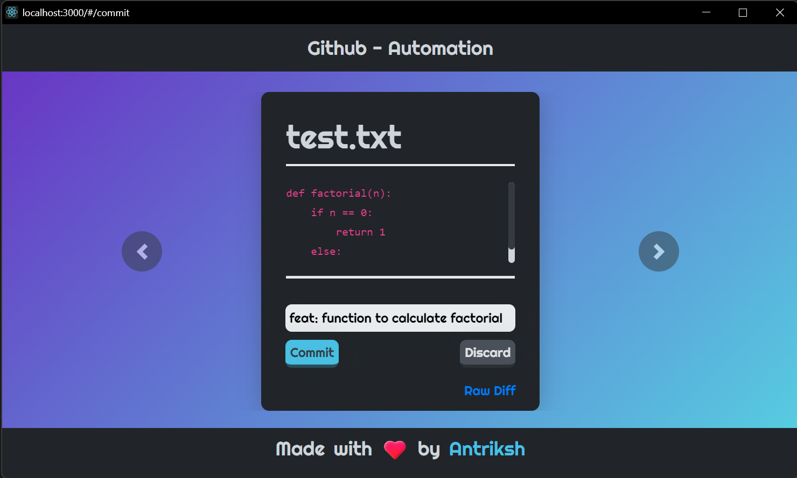

<div align="center"></div>

<!-- <div align="center"></div> -->
<br>

## Installation ⬇️

Download the setup for Github - Automation from [here](https://github.com/antrikshmisri/Github-Automation/releases/download/1.1/gauto.exe) or get the executable from [here](https://github.com/antrikshmisri/Github-Automation/releases/download/1.0/release-1.0.zip)

## What is it about?

Are you tired of writing the same git commands over and over again? If so, this project can help you reduce that effort significantly. The app does this by automating a lot of stuff for you. The user just has to enter the commit message for the changed file, rest the app handles everything for the user.

## Features of Github - Automation

1. Removes repition of entering same git commands
2. Displays the changed `file` along with its `diff` for making it easy to write commit messages
3. Auto pushes the files that have been commited
4. Stores the files in `JSON` file so, you can continue to commit changes later on.
5. Clean and clutter-free UI

## How does it work?

The front-end of Github - Automation is written in `ReactJS`, the logical/pseudo-backend is written in `python`. To integrate ReactJS and python script this app uses a module named `eel`. With the help of `eel`, any javascript code/framework can run a python function and get the return value if any. Learn more about eel for python [here](https://pypi.org/project/Eel/#eel).

This is not a browser based application, rather it is a standalone executable application. This is achieved by yet another module named `pyinstaller`, the `.exe` file runs the python scripts on top of the production build of the `React-App`.

## How to Run?

To run the app in development environment, follow the steps below:-

1. Get python dependencies:-
```bash
pip install -r requirements.txt
```
2. Get the node modules:-
```bash
npm install
```
3. Start the development server:-
```bash
yarn start
```

## Preview Images





# 💥 How to Contribute

[](https://github.com/mohit200008/FoodSaver20008/pulls)
[](https://github.com/ellerbrock/open-source-badges/)

- Take a look at the existing [Issues](https://github.com/ssurbhi09/Github-Automation/issues) or [create a new issue](https://github.com/ssurbhi09/Github-Automation/issues/new/choose)!
- [Fork the Repo](https://github.com/ssurbhi09/Github-Automation/issues/new/fork), create a branch for any issue that you are working on and commit your work.
- Create a **[Pull Request](Github-Automation)** (_PR_), which will be promptly reviewed and given suggestions for improvements by the community.
- Add screenshots or screen captures to your Pull Request to help us understand the effects of the changes that are included in your commits.

## ⭐ HOW TO MAKE A PULL REQUEST:

**1.** Start by making a fork the [**ExamResultGenerator**](https://github.com/mohit200008/FoodSaver20008) repository. Click on the <a href="https://github.com/mohit200008/FoodSaver20008/fork"></a> symbol at the top right corner.

**2.** Clone your new fork of the repository:

```bash
git clone https://github.com/<your-github-username>/FoodSaver20008
```

**3.** Set upstream command:

```bash
git remote add upstream https://github.com/mohit200008.git
```

**4.** Navigate to the new project directory:

```bash
cd Github-Automation
```

**5.** Create a new branch:

```bash
git checkout -b YourBranchName
```

**6.** Sync your fork or local repository with the origin repository:

- In your forked repository click on "Fetch upstream"
- Click "Fetch and merge".

### Alternatively, Git CLI way to Sync forked repository with origin repository:

```bash
git fetch upstream
```

```bash
git merge upstream/main
```

### [Github Docs](https://docs.github.com/en/github/collaborating-with-pull-requests/addressing-merge-conflicts/resolving-a-merge-conflict-on-github) for Syncing

**7.** Make your changes to the source code.

**8.** Stage your changes and commit:

```bash
git add .
```

```bash
git commit -m "<your_commit_message>"
```

**9.** Push your local commits to the remote repository:

```bash
git push origin YourBranchName
```

**10.** Create a [Pull Request](https://help.github.com/en/github/collaborating-with-issues-and-pull-requests/creating-a-pull-request)!

**11.** **Congratulations!** You've made your first contribution! 🙌🏼


## All the best! 🥇

<p align="center">

[](https://github.com/unnati914/Care4ther-)

</p>
